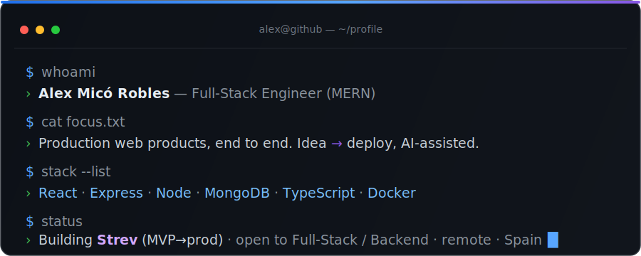
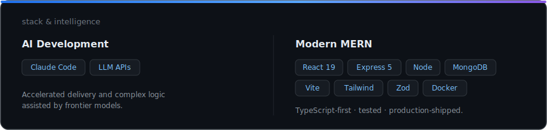
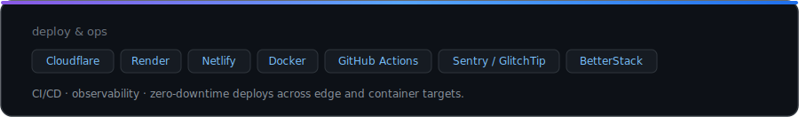
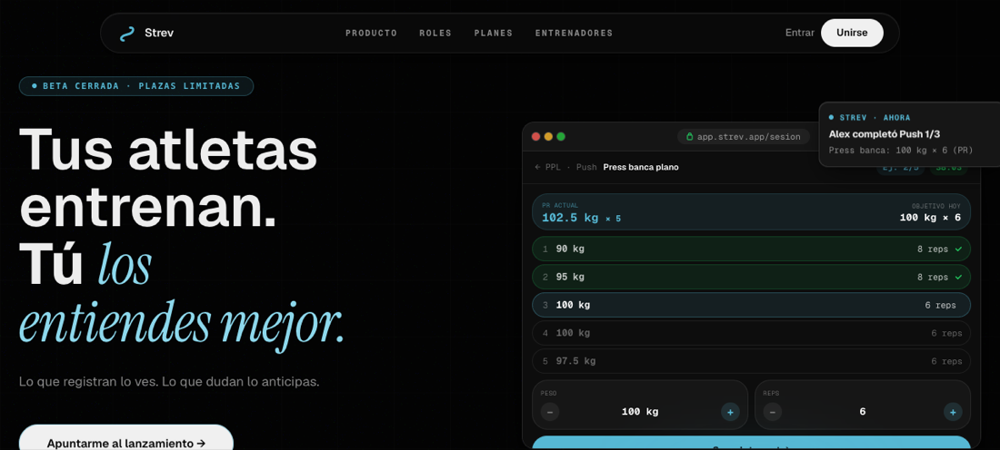
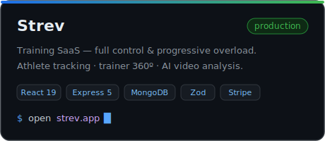
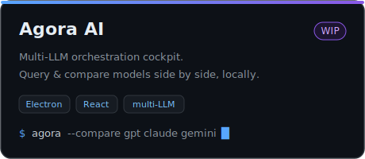
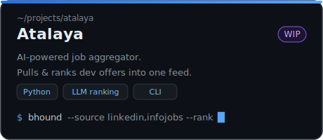
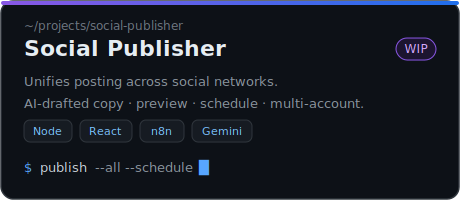
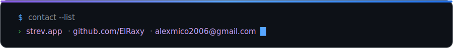

**Open to Full-Stack / Backend roles** — remote · Spain · available now

Strev — live at [strev.app](https://strev.app) · MERN monorepo · CI + E2E + Sentry in production.

## Stack & Intelligence

## How I Build

- **Spec-Driven Development (SDD):** specification and acceptance criteria (EARS notation) before writing code.
- **Harness Engineering:** multi-agent orchestration — parallel subagents write to files, keeping context clean.
- **ADR-driven architecture:** every technical decision documented and linked.
- **TDD + two-layer verification:** automated tests plus end-to-end before anything is called done.
- **Conventional Commits** and systematic code review.

## Projects

### Featured — Strev

<table>
<tr>
<td width="50%"></td>
<td width="50%"></td>
</tr>
<tr>
<td width="50%"></td>
<td width="50%"></td>
</tr>
</table>

Other repos open progressively.

## Contact

[strev.app](https://strev.app) &nbsp;·&nbsp; [github.com/ElRaxy](https://github.com/ElRaxy) &nbsp;·&nbsp; [alexmico2006@gmail.com](mailto:alexmico2006@gmail.com)

