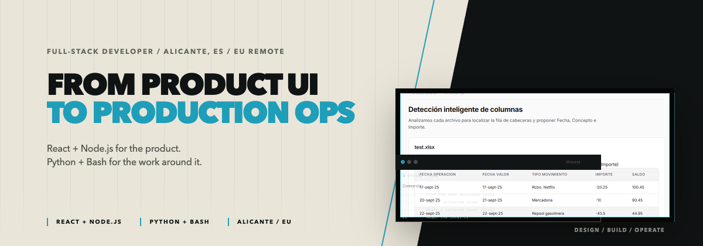
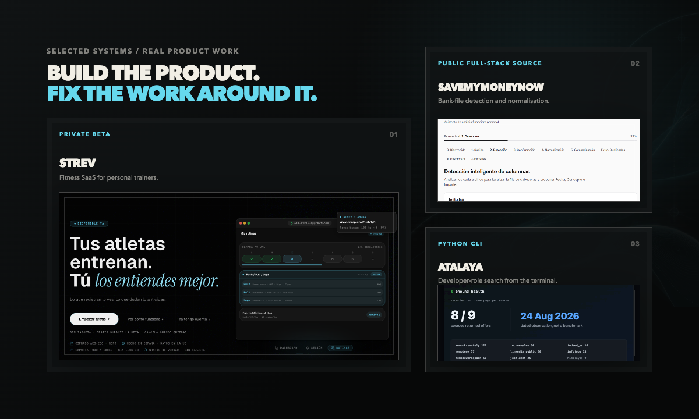

<picture>
  <source media="(prefers-color-scheme: dark)" srcset="./assets/hero-dark.png">
  <source media="(prefers-color-scheme: light)" srcset="./assets/hero-light.png">
  
</picture>

I build the feature, wire the API and make the operation repeatable.

[Portfolio and CV](https://portfolioalex-mico.vercel.app/en/) · [Email](mailto:alexmico2006@gmail.com)

**Now shipping:** [Strev](https://strev.app) through private beta; turning job-search workflows into [Atalaya](https://github.com/ElRaxy/atalaya-cli).

## Selected systems

<picture>
  <source media="(max-width: 600px)" srcset="./assets/selected-work-mobile.png">
  
</picture>

### [Strev](https://strev.app)

Fitness SaaS for personal trainers in private beta. React front end, Node.js API, Stripe payments, gamification and queued Gemini analysis. [Live Strev](https://strev.app) · [Case study](https://portfolioalex-mico.vercel.app/en/projects/strev/)

### [SaveMyMoneyNow](https://github.com/ElRaxy/SaveMyMoneyNow)

React import flow plus an Express/MongoDB pipeline for finding headers, mapping columns and rejecting duplicates. [Source](https://github.com/ElRaxy/SaveMyMoneyNow) · [Case study](https://portfolioalex-mico.vercel.app/en/projects/savemymoneynow/)

### [Atalaya](https://github.com/ElRaxy/atalaya-cli)

Python CLI that collects and scores Spanish and EU roles, then drafts tailored application material. [Source](https://github.com/ElRaxy/atalaya-cli) · [Case study](https://portfolioalex-mico.vercel.app/en/projects/atalaya/)

## Beyond the UI

At Anuubis Solutions I move between React/Node features and the operational work around them: provider migrations, performance, DNS, Linux and incidents. Repeatable fixes become Python or Bash checks.

## How I work

Small diffs, explicit acceptance criteria, relevant tests, and a browser or terminal check before I call it done.

`React` · `Node.js` · `Python` · `Bash` · `MongoDB` · `Stripe` · `GitHub Actions`
