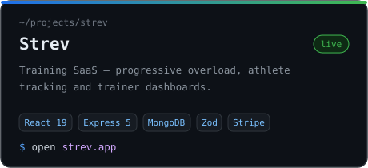
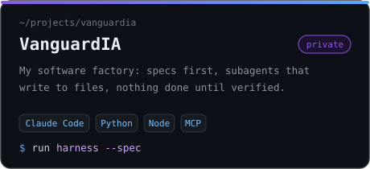
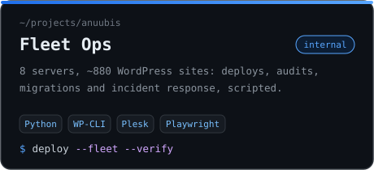
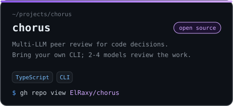
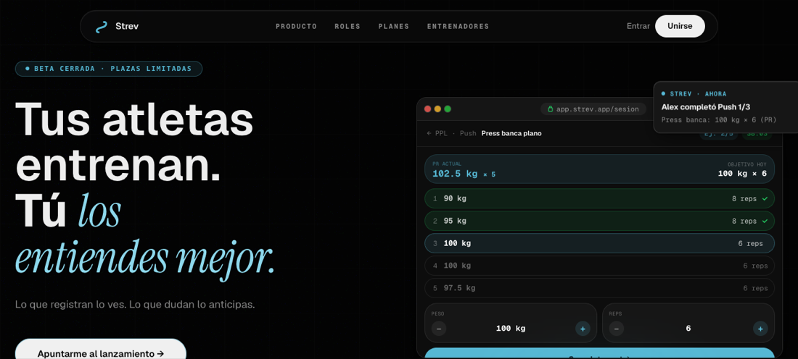
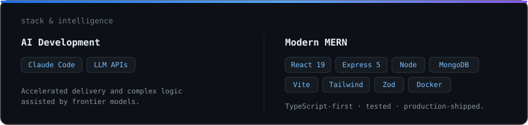
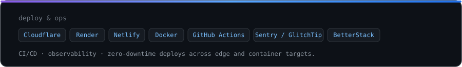
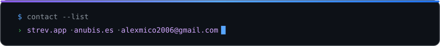

<h3><code>alex@github ~ $ ./contributions.sh</code></h3>

  

<h3><code>alex@github ~ $ whoami</code></h3>

<table>
<tr>
<td valign="top"></td>
<td valign="top"></td>
</tr>
</table>

## What I'm building

<table>
<tr>
<td width="50%"></td>
<td width="50%"></td>
</tr>
<tr>
<td width="50%"></td>
<td width="50%"></td>
</tr>
</table>

Strev and chorus are open to look at. VanguardIA and the fleet work are private, so
the cards above are the shape of them, not the code.

- **[Strev](https://strev.app)** — live, in beta.
- **[chorus](https://github.com/ElRaxy/chorus)** — public repo, bring your own CLI.
- **VanguardIA** and **Fleet Ops** — private.

### Featured — Strev

## How I work

- **Specs first.** Acceptance criteria in EARS notation before the first line of code, so "done" is something you can check instead of argue about.
- **Agents in the loop, not in charge.** Parallel subagents write their output to files; I keep the architecture, the boundaries and the final call.
- **Two layers of verification.** Automated tests, then the real thing in a real browser. A green test suite is not a shipped feature.
- **Decisions get written down.** ADRs and runbooks, so the reasoning survives the session that produced it.
- **Small diffs, conventional commits, no drive-by refactors.**

## Stack

## Contact

[anubis.es](https://www.anubis.es) &nbsp;·&nbsp; [strev.app](https://strev.app) &nbsp;·&nbsp; [alexmico2006@gmail.com](mailto:alexmico2006@gmail.com)

The heatmap regenerates itself every day (<a href="./.github/workflows/update-profile-art.yml">workflow</a>). The portrait and the card are rebuilt by hand from <code>scripts/</code> when something changes.
