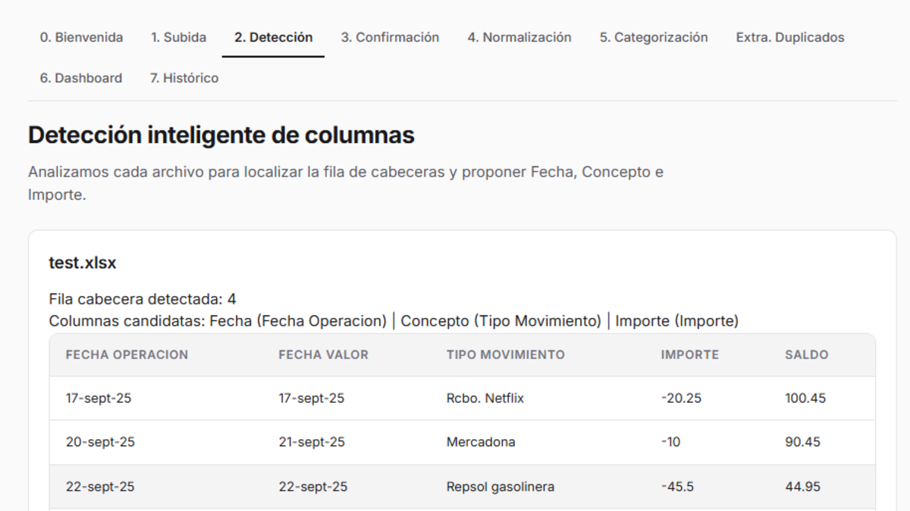
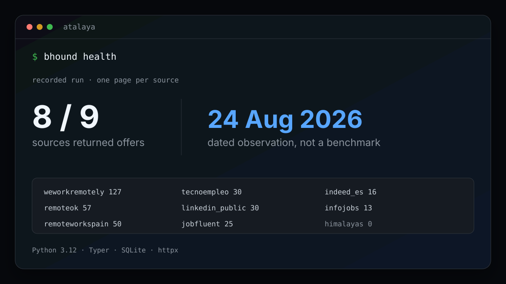

# Alex Micó Robles

Full-stack developer working mainly with React, Node.js and MongoDB. When a task is repetitive or easy to get wrong by hand, I usually turn it into a Python or Bash tool.

Based in Alicante, Spain. I work at Anuubis Solutions and am open to full-stack roles in Spain or remote across the EU.

[Portfolio](https://portfolioalex-mico.vercel.app) · [Email](mailto:alexmico2006@gmail.com)

## Work I can show

### [SaveMyMoneyNow](https://github.com/ElRaxy/SaveMyMoneyNow)

Every bank exports its spreadsheets differently. SaveMyMoneyNow finds the actual header row, proposes the date, description and amount columns, normalises the data and catches duplicate imports before the final write to MongoDB. I built the React wizard, Express API and transaction pipeline.

[Source](https://github.com/ElRaxy/SaveMyMoneyNow) · [Case study](https://portfolioalex-mico.vercel.app/en/projects/savemymoneynow/) · `React` `Node.js` `Express` `MongoDB`

### [Atalaya](https://github.com/ElRaxy/atalaya-cli)

Atalaya is a Python CLI for the Spanish and EU remote job market. It reads RSS feeds, JSON APIs and server-rendered job boards, removes duplicates, ranks each role against a local profile and drafts tailored letters and CV variants through Claude. The repository includes 13 commands and 174 tests.

[Source](https://github.com/ElRaxy/atalaya-cli) · [Recorded health check](./assets/evidence/atalaya-health-2026-08-24.json) · [Case study](https://portfolioalex-mico.vercel.app/en/projects/atalaya/) · `Python` `Typer` `SQLite` `Claude CLI`

### [Strev](https://strev.app)

Strev is a fitness SaaS for freelance personal trainers, now in private beta. I work across its React front end and Node.js API, including authentication, payments, gamification and video technique analysis with Gemini. The video work runs in a queue, so the HTTP request can return immediately.

[Live product](https://strev.app) · [Case study](https://portfolioalex-mico.vercel.app/en/projects/strev/) · `React` `Node.js` `MongoDB` `Gemini`

## Work in production

At Anuubis Solutions I work on application code and the systems around it: React and Node.js changes, provider migrations, performance audits, DNS, Linux servers and production incidents. I script repeatable operations and leave a check behind so the result can be reproduced.

## How I work

Before a larger change, I write down the behaviour that has to hold. Then I keep the diff small, run the relevant tests, inspect the result in the browser or terminal and save the evidence. Claude Code helps with research and implementation; acceptance criteria, review and final verification stay explicit.

`React` · `Node.js` · `Express` · `MongoDB` · `Python` · `Bash` · `GitHub Actions` · `Linux`
