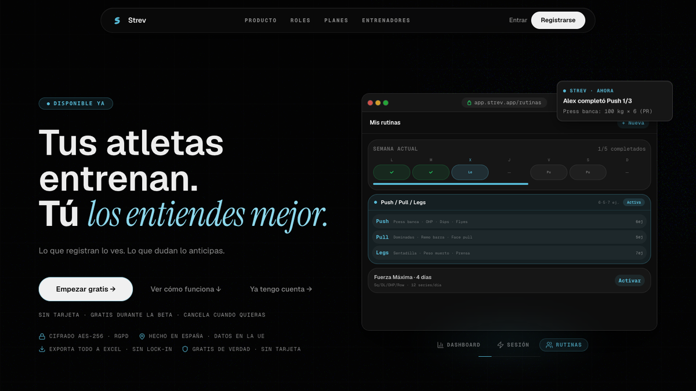
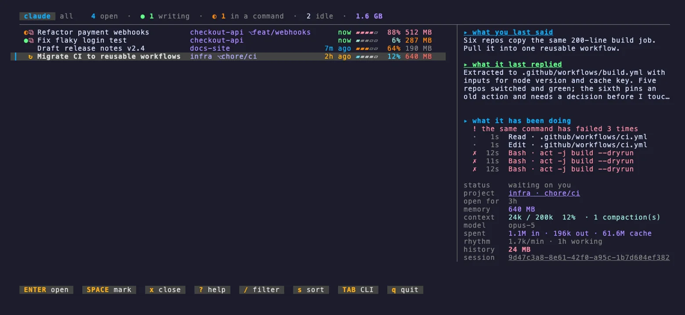

# Alex Micó Robles

Full Stack developer currently focused on two products: Strev, a web product for personal trainers, and Sereno, a local terminal UI for coding-agent sessions. React and Node.js for product work; Python when a focused tool is the better answer.

[Portfolio](https://portfolioalex-mico.vercel.app/en/) · [CV](https://portfolioalex-mico.vercel.app/Alex_Mico_Robles_CV_EN.pdf) · [Email](mailto:alexmico2006@gmail.com)

## Main work

### Strev

Strev gives personal trainers one place to build routines, follow progress, handle payments and review technique on video. I work across its React interface and Node.js API, including the queue that keeps video analysis out of the request path.

[Visit Strev](https://strev.app) · [Read the case study](https://portfolioalex-mico.vercel.app/en/projects/strev/)

### Sereno

Sereno is a single-file Python terminal UI I use to see which Claude Code, Codex, Gemini and Antigravity sessions are writing, running a command, waiting or stopped. It reads local histories and sends nothing off the machine.

[Source](https://github.com/ElRaxy/sereno) · [Latest release](https://github.com/ElRaxy/sereno/releases/latest) · [Read the case study](https://portfolioalex-mico.vercel.app/en/projects/sereno/)

## Other products

- **[RoguePatch Lab](https://github.com/ElRaxy/roguepatch-lab)** is an adversarial bench for external coding-agent controls: it measures whether a control stops what it claims to stop, with a deterministic oracle and typed evidence instead of an LLM judge. 366 tests, strict mypy, MIT.
- **[SaveMyMoneyNow](https://github.com/ElRaxy/SaveMyMoneyNow)** imports bank statements whose layout changes between files. It finds the header, suggests the column mapping and checks duplicates before saving. [Case study](https://portfolioalex-mico.vercel.app/en/projects/savemymoneynow/).
- **[Atalaya](https://github.com/ElRaxy/atalaya-cli)** collects developer roles from several sources, removes duplicates and ranks them against a profile. The person still chooses which applications are worth pursuing. [Case study](https://portfolioalex-mico.vercel.app/en/projects/atalaya/).
